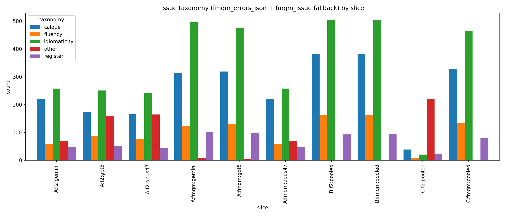
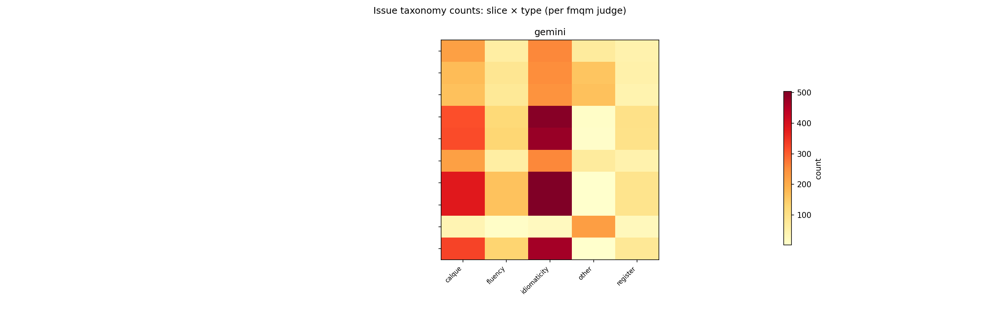
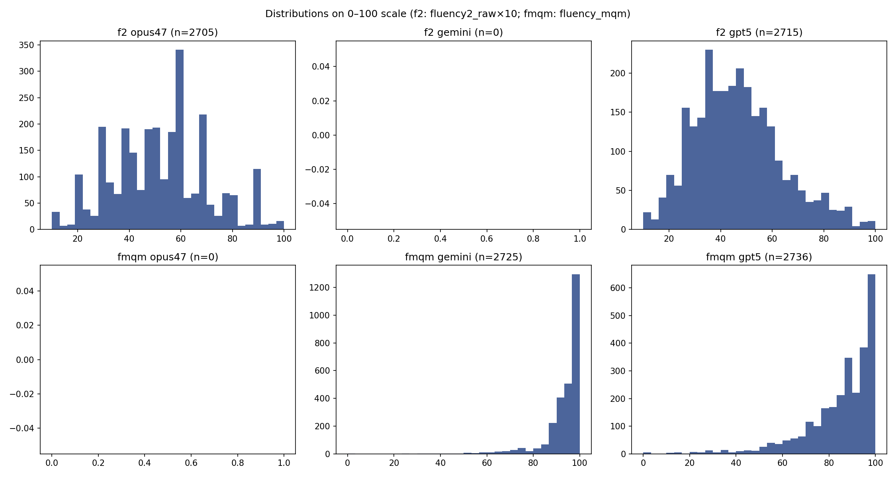

# MQM three-judge error analysis (fluency2 & fluency_mqm)

## Input resolution log

```
OK sampled_segments -> /Users/admin/Code/benchmarks/data_interim/wmt_mqm/sampled_segments.parquet
OK fluency2_opus47 -> /Users/admin/Code/benchmarks/data_interim/wmt_mqm/fluency2_opus47.parquet
MISSING: fluency2_gemini — tried [PosixPath('/Users/admin/Code/benchmarks/data_interim/wmt_mqm/fluency2_gemini.parquet')]
OK fluency2_gpt5 -> /Users/admin/Code/benchmarks/data_interim/wmt_mqm/fluency2_gpt5.parquet
MISSING: fluency_mqm_opus47 — tried [PosixPath('/Users/admin/Code/benchmarks/data_interim/wmt_mqm/fluency_mqm_opus47.parquet')]
OK fluency_mqm_gemini -> /Users/admin/Code/benchmarks/data_interim/wmt_mqm/fluency_mqm_gemini_fluency_mqm.parquet
OK fluency_mqm_gpt5 -> /Users/admin/Code/benchmarks/data_interim/wmt_mqm/fluency_mqm_gpt5_fluency_mqm.parquet
sampled_segments: 44 rows involved in duplicate keys ['seg_id', 'system_id']
  wrote /Users/admin/Code/benchmarks/data_interim/error_analysis/tables/duplicate_keys_sampled_segments.csv
sampled_segments: collapsed 22 duplicate-key rows (keep='first')
fluency2_opus47: 44 rows involved in duplicate keys ['seg_id', 'system_id']
  wrote /Users/admin/Code/benchmarks/data_interim/error_analysis/tables/duplicate_keys_fluency2_opus47.csv
fluency2_opus47: collapsed 22 duplicate-key rows (keep='first')
MISSING side: fluency2_gemini
fluency2_gpt5: 44 rows involved in duplicate keys ['seg_id', 'system_id']
  wrote /Users/admin/Code/benchmarks/data_interim/error_analysis/tables/duplicate_keys_fluency2_gpt5.csv
fluency2_gpt5: collapsed 22 duplicate-key rows (keep='first')
MISSING side: fluency_mqm_opus47
fluency_mqm_gemini: 44 rows involved in duplicate keys ['seg_id', 'system_id']
  wrote /Users/admin/Code/benchmarks/data_interim/error_analysis/tables/duplicate_keys_fluency_mqm_gemini.csv
fluency_mqm_gemini: collapsed 22 duplicate-key rows (keep='first')
fluency_mqm_gpt5: 44 rows involved in duplicate keys ['seg_id', 'system_id']
  wrote /Users/admin/Code/benchmarks/data_interim/error_analysis/tables/duplicate_keys_fluency_mqm_gpt5.csv
fluency_mqm_gpt5: collapsed 22 duplicate-key rows (keep='first')
```

## Tables

- [tables/bias_calibration.csv](tables/bias_calibration.csv)
- [tables/variance_collapse.csv](tables/variance_collapse.csv)
- [tables/slice_overlap.csv](tables/slice_overlap.csv)
- [tables/issue_types.csv](tables/issue_types.csv)
- [tables/self_preference.csv](tables/self_preference.csv)
- [tables/merge_missing_counts.csv](tables/merge_missing_counts.csv)

### bias_calibration (preview)
| mode   | judge   |    n |   mean_metric_z_minus_human_z |   linreg_slope |   linreg_intercept |   linreg_r2 | note   |
|:-------|:--------|-----:|------------------------------:|---------------:|-------------------:|------------:|:-------|
| f2     | opus47  | 2605 |                    0.00278527 |       0.254703 |         0.00341235 |   0.0645764 | nan    |
| f2     | gemini  |    0 |                  nan          |     nan        |       nan          | nan         | n<30   |
| f2     | gpt5    | 2615 |                    0.00246468 |       0.242979 |         0.00289608 |   0.0581946 | nan    |
| fmqm   | opus47  |    0 |                  nan          |     nan        |       nan          | nan         | n<30   |
| fmqm   | gemini  | 2627 |                   -0.00253044 |       0.551618 |        -0.00279619 |   0.299621  | nan    |
| fmqm   | gpt5    | 2636 |                   -0.0026858  |       0.513891 |        -0.0026858  |   0.261098  | nan    |

### variance_collapse (preview)
| mode   | judge   |    n |   pct_ge_98_on_0_100_scale |   std_raw_metric_on_0_100 | note   |
|:-------|:--------|-----:|---------------------------:|--------------------------:|:-------|
| f2     | opus47  | 2705 |                 0.00584795 |                  18.3701  | nan    |
| f2     | gemini  |    0 |               nan          |                 nan       | n<30   |
| f2     | gpt5    | 2715 |                 0.00365497 |                  17.0664  | nan    |
| fmqm   | opus47  |    0 |               nan          |                 nan       | n<30   |
| fmqm   | gemini  | 2725 |                 0.418129   |                   9.69378 | nan    |
| fmqm   | gpt5    | 2736 |                 0.232091   |                  15.9275  | nan    |

### slice_overlap (preview)
| slice_a     | slice_b       |   jaccard |
|:------------|:--------------|----------:|
| A:f2:gemini | A:f2:gpt5     | 0.102941  |
| A:f2:gemini | A:f2:opus47   | 0.0968921 |
| A:f2:gemini | A:fmqm:gemini | 0.109057  |
| A:f2:gemini | A:fmqm:gpt5   | 0.0909091 |
| A:f2:gemini | A:fmqm:opus47 | 1         |
| A:f2:gemini | B:f2:pooled   | 0.0989011 |
| A:f2:gemini | B:fmqm:pooled | 0.0989011 |
| A:f2:gemini | C:f2:pooled   | 0.0714286 |
| A:f2:gemini | C:fmqm:pooled | 0.100917  |
| A:f2:gpt5   | A:f2:opus47   | 0.604278  |
| A:f2:gpt5   | A:fmqm:gemini | 0.25261   |
| A:f2:gpt5   | A:fmqm:gpt5   | 0.192843  |
| A:f2:gpt5   | A:fmqm:opus47 | 0.102941  |
| A:f2:gpt5   | B:f2:pooled   | 0.25523   |
| A:f2:gpt5   | B:fmqm:pooled | 0.25523   |

## Figures







## Interpretability guardrails

- Any CSV row with `note` containing `n<30`: **do not treat differences as reliable**.
- `pct_ge_98_on_0_100_scale` for **f2** uses `fluency2_raw×10` (same 0–100 scale as MQM fluency head).
- Duplicate `(seg_id, system_id)` keys are collapsed with `keep='first'`; see `tables/duplicate_keys_*.csv`.
